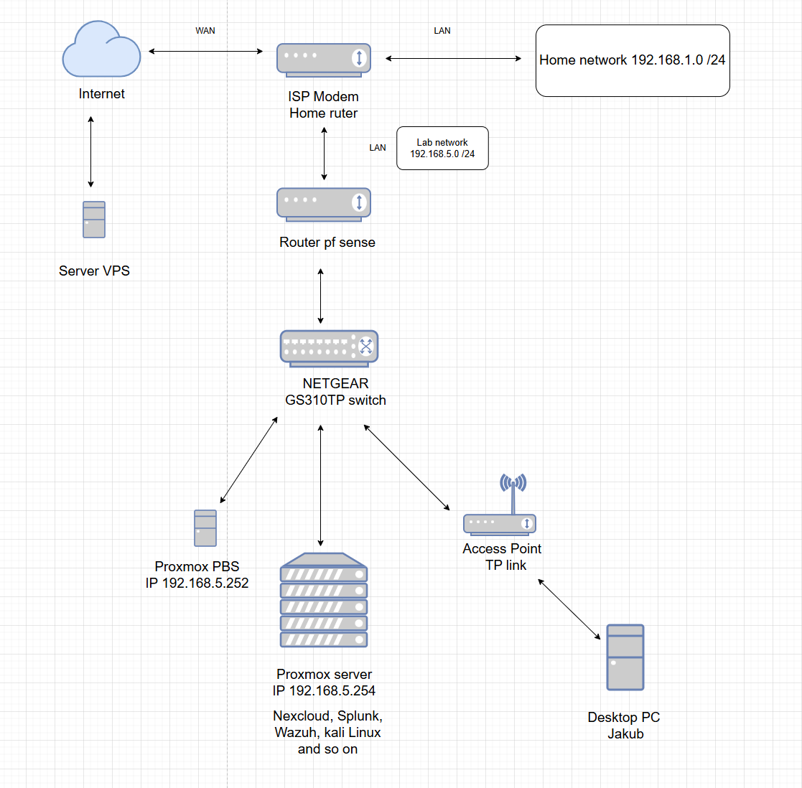

The goal of this project is to set up a cybersecurity home lab, accompanied by a comprehensive guide and documentation.

#  Homelab Infrastructure & Network Topology

Welcome to my Homelab repository! This project documents my home laboratory setup, network segmentation, hardware components, and hosted services.

---

##  Network Topology

  

---

## 🌐 Network Addressing & Device Inventory

| Device / Host | Role / OS | IP Address / Subnet | Description |
| :--- | :--- | :--- | :--- |
| **ISP Modem / Home Router** | Gateway / Stock OS | `192.168.1.1/24` | Main home network gateway & DHCP server for IoT/family devices |
| **pfSense Router** | Firewall & Router | `192.168.5.1/24` | Lab gateway providing network segmentation, firewalling & routing |
| **NETGEAR GS310TP** | Smart Managed Switch | `192.168.5.X/24` | Central gigabit switch for lab equipment |
| **Proxmox VE** | Hypervisor (PVE) | `192.168.5.254/24` | Primary compute node hosting virtual machines & containers |
| **Proxmox PBS** | Backup Server | `192.168.5.252/24` | Dedicated backup node for Proxmox VM snapshots and deduplication |
| **TP-Link Access Point** | Wireless AP | `192.168.5.X/24` | Dedicated AP providing wireless access to the lab network |
| **Desktop PC (Jakub)** | Client Workstation | DHCP (`192.168.5.X`) | Workstation connected via Wi-Fi to the lab AP |
| **Server VPS** | Linux Cloud Node | Public IP | Cloud VPS integrated via VPN tunnel for remote logging and ingestion |

---

##  Hosted Virtual Machines & Containers (Proxmox VE)

* **Nextcloud**: Private cloud storage and file synchronization.
* **Splunk SIEM**: Log aggregation and security monitoring (ingesting logs from local nodes & external VPS).
* **Wazuh**: Host-based intrusion detection system (HIDS) & XDR.
* **Kali Linux**: Security auditing and penetration testing environment.

---

##  Traffic Flow & VPN Integration

1. **Lab Isolation**: The lab operates on its own dedicated `192.168.5.0/24` subnet behind a pfSense firewall, isolated from the primary home network (`192.168.1.0/24`).
2. **VPS & Splunk Telemetry**: An encrypted tunnel (e.g., WireGuard / OpenVPN) connects the external VPS to the internal **Splunk** instance, allowing secure log collection without exposing internal services directly to the public internet.

