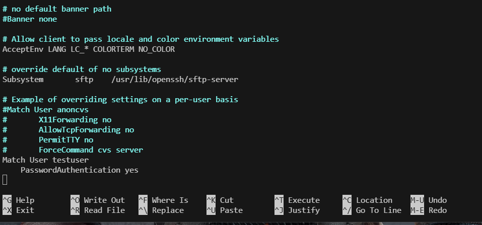
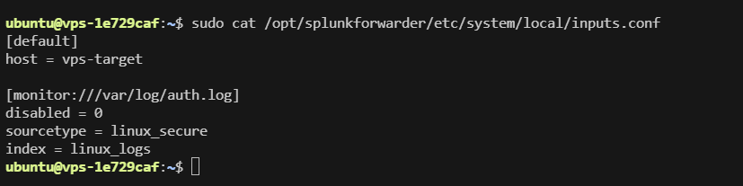
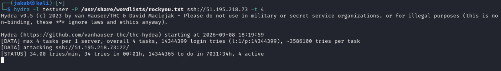
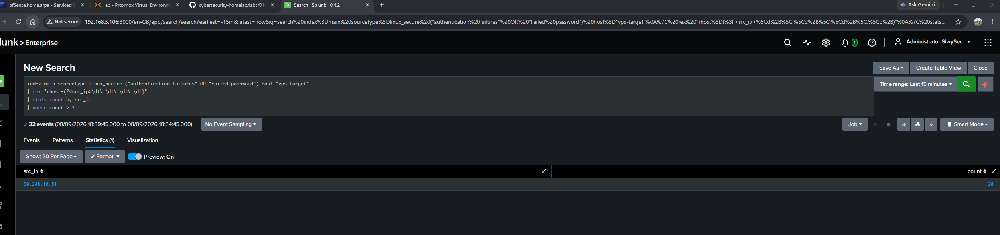
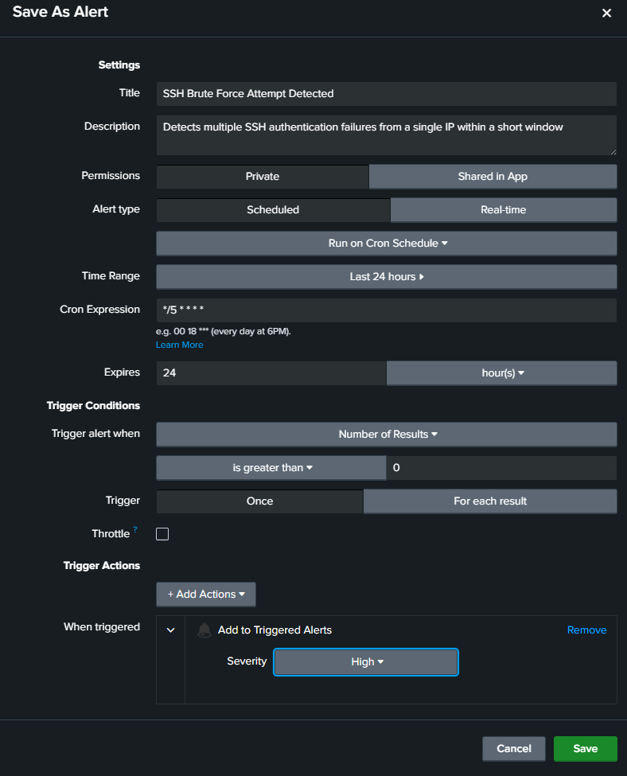
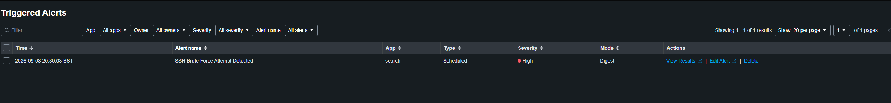

# SSH Brute Force Detection and Automated Alerting with Splunk SIEM

## Overview
This hands-on cybersecurity project simulates a real-world external brute force attack against a hardened Linux server and implements an end-to-end detection and alerting pipeline using **Splunk Enterprise SIEM**.

The objective was to gain practical experience with telemetry ingestion, Search Processing Language (SPL) query development, field extraction using regular expressions, and SOC incident generation, followed by post-engagement host hardening.

---

## Architecture & Lab Topology

```text
+---------------------------+             +-------------------------------+
|  Attacker Machine (Kali)  |  Internet   |      Target Host (Ubuntu)     |
|     IP: 90.248.10.51      | ----------> |     Public IP: 51.195.218.73  |
|      Tool: THC Hydra      |  (Port 22)  |   Log: /var/log/auth.log      |
+---------------------------+             +---------------+---------------+
                                                          |
                                           Splunk Forwarder (Port 9997)
                                              via WireGuard / VPN
                                                          v
                                          +---------------+---------------+
                                          |     Splunk Enterprise SIEM    |
                                          |      (Hosted on Proxmox)      |
                                          |          192.168.5.106        |
                                          +-------------------------------+
```

* **Target Host:** Hardened Ubuntu VPS hosted externally.
* **Attacker System:** Kali Linux performing password spray and dictionary attacks.
* **Log Ingestion:** Splunk Universal Forwarder running as a dedicated system user (`splunkfwd`) shipping authentication telemetry across an encrypted private VPN tunnel.
* **SIEM Platform:** Splunk Enterprise running locally inside a Proxmox virtualized environment.

---

## Step 1: Controlled Environment Preparation & Hardening Bypass

To simulate a realistic compromise vector against an otherwise key-only hardened VPS, a controlled exception was established for a decoy user (`testuser`) while maintaining global key-based security.

```ini
# /etc/ssh/sshd_config
Match User testuser
    PasswordAuthentication yes
```



---

## Step 2: Splunk Forwarder Configuration & Telemetry Routing

The Splunk Universal Forwarder was deployed on the VPS to tail `/var/log/auth.log`. The forwarding account was assigned to the `adm` group to grant read access to system log files without requiring root execution privileges.

**Forwarder Configuration (`/opt/splunkforwarder/etc/system/local/inputs.conf`):**
```ini
[default]
host = vps-target

[monitor:///var/log/auth.log]
disabled = 0
sourcetype = linux_secure
index = main
```

**Outputs Configuration (`/opt/splunkforwarder/etc/system/local/outputs.conf`):**
```ini
[tcpout]
defaultGroup = default-autolb-group

[tcpout:default-autolb-group]
server = 192.168.5.106:9997
```



---

## Step 3: Simulating the Attack (THC Hydra)

From the Kali Linux system, a dictionary-based brute force attack was executed against port 22 on the target host using `hydra` and the standard `rockyou.txt` wordlist. Concurrency was limited (`-t 4`) to ensure sustained interaction with the daemon without triggering immediate connection resets.

```bash
hydra -l testuser -P /usr/share/wordlists/rockyou.txt ssh://51.195.218.73 -t 4
```



---

## Step 4: Investigating and Aggregating Telemetry in Splunk

On modern Linux distributions, SSH authentication failures trigger PAM warning records and rate-limiting connection closes. 

To identify the malicious IP address and quantify the attack volume, an SPL query was developed using field extraction via regular expressions (`rex`):

```spl
index=main sourcetype=linux_secure ("authentication failures" OR "Failed password") host="vps-target"
| rex "rhost=(?<src_ip>\d+\.\d+\.\d+\.\d+)"
| stats count by src_ip
| where count > 3
```



The query successfully identified the source IP (`90.248.10.51`) and aggregated repeated unsuccessful attempts within the evaluation window.

---

## Step 5: Automated Detection & Scheduled Alert Configuration

To automate incident detection, the SPL query was operationalized into a scheduled alert within Splunk:

* **Alert Title:** `SSH Brute Force Attempt Detected`
* **Trigger Condition:** Number of results is greater than `0`
* **Schedule:** Cron schedule evaluated every 5 minutes (`*/5 * * * *`)
* **Time Range:** Past 24 hours (sliding evaluation window)
* **Trigger Action:** `Add to Triggered Alerts` with **High** severity



---

## Step 6: Incident Generation Verification

Once the scheduled cron job evaluated the indexed events, the alert fired as designed, generating a high-priority incident visible to SOC analysts.



---

## Step 7: Post-Lab Remediation & Clean-up

Following successful verification of the detection workflow, the host was restored to its hardened security baseline:

1. **Reverted SSH Configuration:** Removed the `Match User` directive in `/etc/ssh/sshd_config` and re-applied strict public key-only authentication (`PasswordAuthentication no`).
2. **Configuration Test & Restart:**
   ```bash
   sudo sshd -t && sudo systemctl restart ssh
   ```
3. **Account Deactivation:** Locked the decoy testing account:
   ```bash
   sudo passwd -l testuser
   ```

---

## Skills & Technologies Demonstrated

* **SIEM & Log Management:** Splunk Enterprise, Splunk Universal Forwarder, SPL, Regex field extraction.
* **Offensive Security / Emulation:** Kali Linux, THC Hydra, Network recon.
* **Host & Cloud Security:** Linux PAM auditing, OpenSSH daemon security profiles, privilege management (`adm` group), least-privilege forwarding.
* **Detection Engineering:** Alert thresholding, cron-based scheduling, SOC incident life-cycle.
